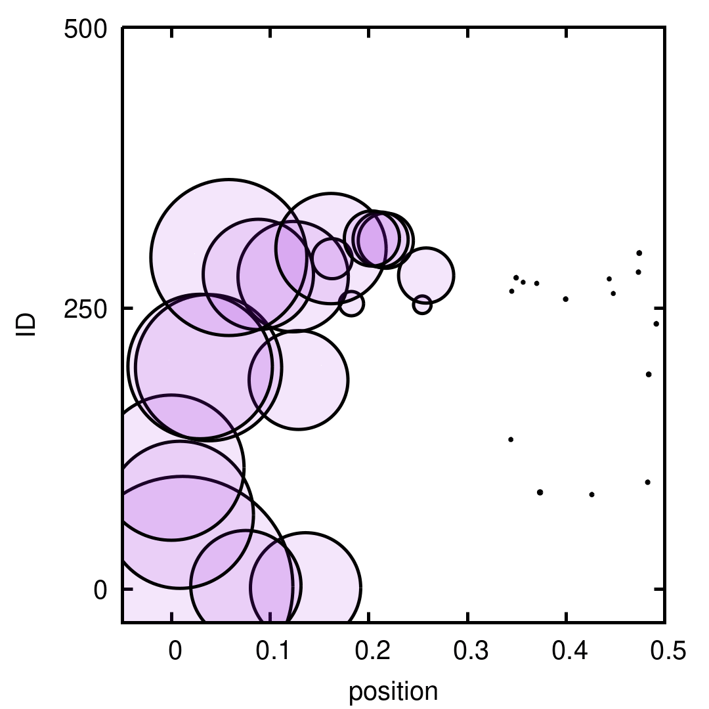
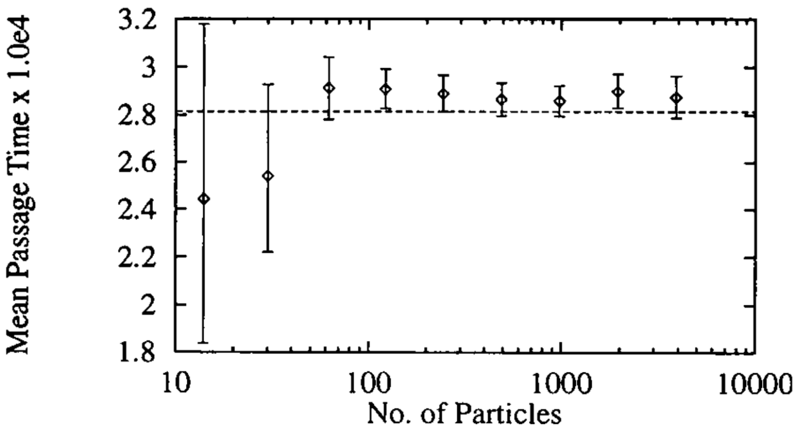
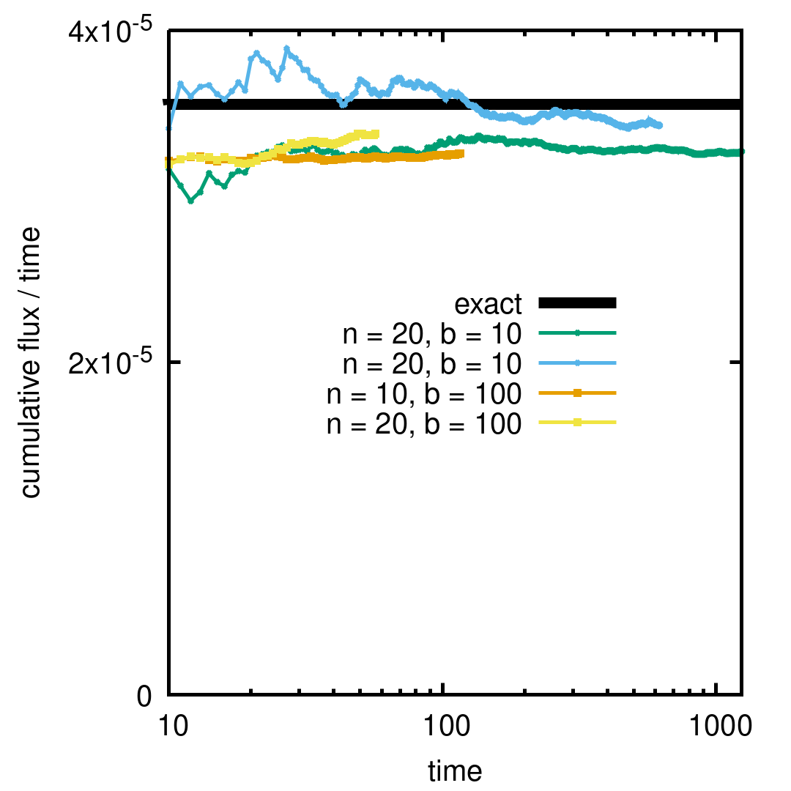

<h1>Weighted Ensemble method</h1>

<h2>Build</h2>

Requires GSL, pkg-config, gnuplot
<pre>
$ make
</pre>

<h2>Run</h2>

<pre>
$ ./merge
$ sh merge.sh
</pre>

<h2>Videos</h2>

[merge](https://user-images.githubusercontent.com/115638/134638531-85c090ea-8d53-4bc7-9a2d-f43a60cef215.mp4)

[bin constant](https://user-images.githubusercontent.com/115638/134639377-fa474df5-c65a-4630-96e4-03240b43c567.mp4)

[bin step](https://user-images.githubusercontent.com/115638/134639382-4c491169-2db6-418c-8f2b-556d81623b8d.mp4)

<h2>Validation</h2>

<pre>
(%i1) exp(-F)/F^2 + 1/F - exp(-F*z)/F^2 - z/F, z = 0, F = -15.76;
(%o1)                          28142.81703321114
(%i2) 1/%o1;
(%o2)                        3.553304556611753E-5
</pre>

 

